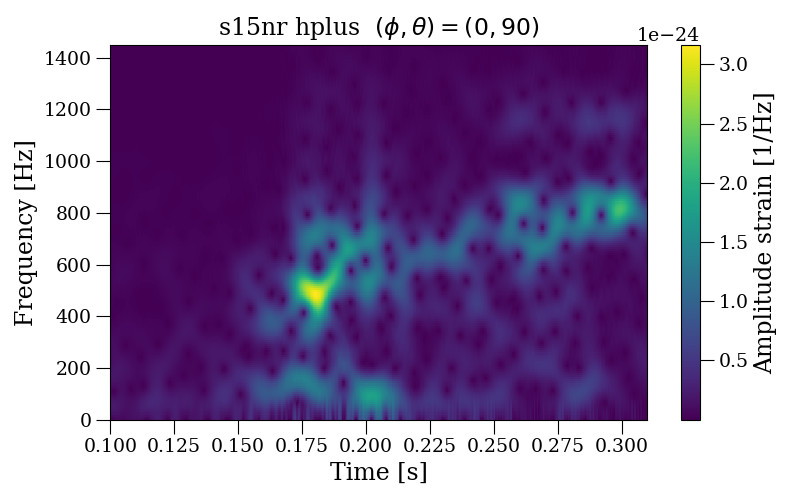
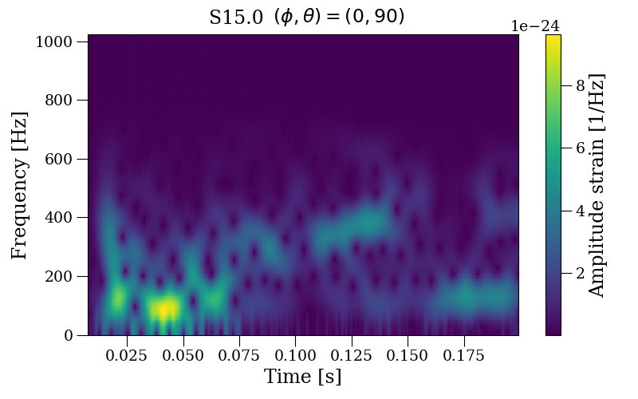

# CCSNeHFGW_ResNetClass
Python pipeline for characterizing the high frequency feature (HFF) present in Gravitational Waves (GW) emitted by Core-Collapse Supernovae.

The HFF is a feature which emerges, until now, in all numerical relativity CCSNe simulations; having a fre monotonically increasing frequency on time on spectrograms/scalograms. See Fig. 1

 
Fig 1. Two examples of the HFF in numerical CCSNe GW.

As a first case of study, this pipeline we draw on phenomenological CCSNe waveforms, generated as in works [Lopez et al Phys. Rev. D 103, 063011](https://doi.org/10.1103/PhysRevD.103.063011) and [Tiznado et al RCS 152(6), 2023](https://www.rcs.cic.ipn.mx/2023_152_6/).

This pipeline has two big procedures. Firstly, the generation of a dataset containing time-frequency scalograms as pixelized images; and secondly, the application of a ResNet50 algorithm to perform a a multi-label classification to discriminate images samples depending of their HFFs.
