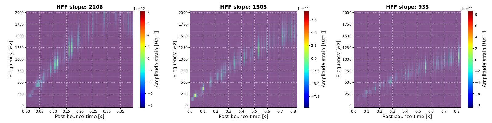

# CCSNeHFGW_ResNetClass
Python pipeline for characterizing the high frequency feature (HFF) in Gravitational Waves (GW) emitted by Core-Collapse Supernovae (CCSNe). This pipeline was implemented as a posterior analysis to GW searching, in order to study the detectability of the HFF given a dataset of samples containg GW events embedded in real LIGO-Virgo noise. Written by Manuel D. Morales, <manueld.morales@academicos.udg.mx>.

<b><ins>The astrophysical problem</ins></b>

CCSNe are one of the most violents phenomena in the universe, in which diverse physical processes are involved. They have their origin in the final life-stage of a massive star, with initial masses $9M_{\odot} \lesssim M \lesssim 24M_{\odot}$ for metallicties less than solar. For the case of a remaining iron nuclei, these dissociate into alpha particles and free nucleons, thermal energy is absorbed, and the core is contracted and finally collapse is produced. After this collapse, a proto-neutron star (PNS) is formed, and a shock wave (the stellar envelope) is launched to the interstellar medium.

Because here we are in the strong gravity regime, GW (stochastic) signals are emitted, and it is expected that this GW carry information about the physical process of the PNS. Indeed, the HFF is one of the signatures of CCSNe GW which contains information about the PNS pulsation, emerging in all current numerical relativity simulations. On time-frequency (TF) spectrograms/scalograms, the HFF has monotonically increasing profile. In Fig. 1 are spectrograms of two simulated CCSNe GW, in which the HFF appears.

<b>Figure 1</b>. Two examples of the HFF in numerical CCSNe GW: Andresen et al 2017, and Kuroda et al 2017.

Until now, CCSNe GW still are not been detected, then we need to anticipate techniques to detect and characterize features as the HFF.

<b><ins>Technical details about this work</ins></b>

As a first case of study, in this study we developed a robust pipeline to characterize the HFF present in phenomenological waveforms -a kind of waveforms that was introduced in [Lopez et al 2021](https://doi.org/10.1103/PhysRevD.103.063011) and later we also generate with our own codes [Tiznado et al 2023](https://www.rcs.cic.ipn.mx/2023_152_6/). These phenomenological waveforms do not have physical information such as those generated by multi-dimensional CCSNe simulations, but are useful to mimic the effect of the HFF in the time-frequency representation. The characterization, particularly, is performed as a 3-label ResNet50 classifier, defining three ranges of the HFF slope:

- <b>Class 1</b>: $1,620 \lt \text{Slope}_{HFF} \lt 4,990$
- <b>Class 2</b>: $1,450 \lt \text{Slope}_{HFF} \lt 1,620$
- <b>Class 3</b>: $950 \lt \text{Slope}_{HFF} \lt 1,450$

Fig. 2 shows three representative phenomenological waveforms, each one belonging to each class, depending on the slope of the HFF.

<b>Figure 2</b>. Scalograms (based on a Morlet Wavelet Transform) of three phenomenological waveforms

This pipeline has two big procedures. Firstly, the generation of a dataset containing time-frequency scalograms as pixelized images; and secondly, the application of a ResNet50 algorithm to perform a a multi-label classification to discriminate images samples depending of their HFFs.

<b>Pipeline structure</b>

<b>Suggestions to easyly run the pipeline</b>
